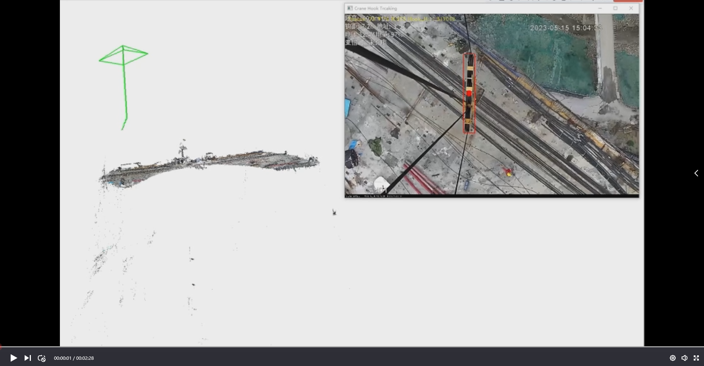
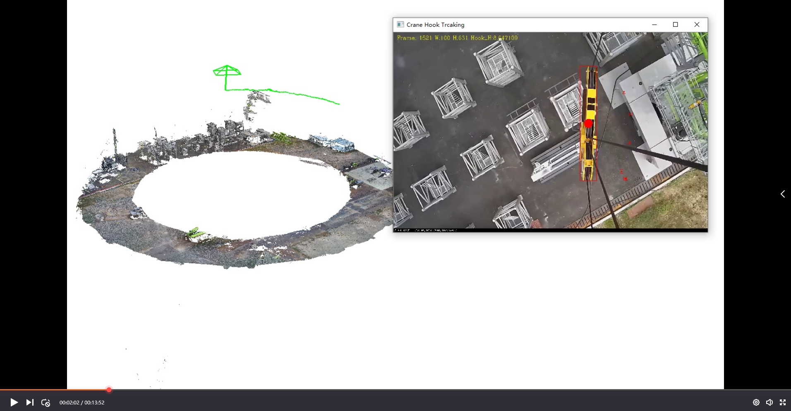
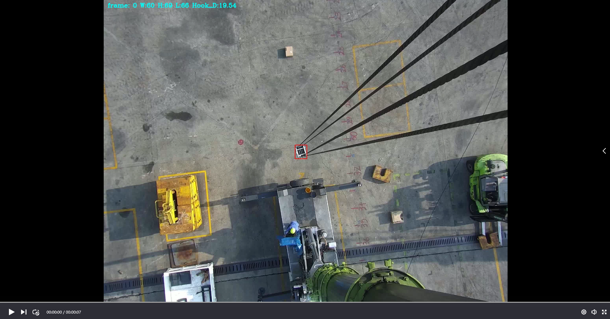

# Crane-hook-position-perception
paper: Crane hook position perception and safety warning

[Tower crane hook track in 3D map.]

[All-terrain crane hook tracking.]

@ARTICLE{11216103,
  author={Yin, Yufeng and Liu, Xiaoyan and Li, Guancheng and Fan, Qing and Li, Sanglan},
  journal={IEEE Transactions on Instrumentation and Measurement}, 
  title={Accurate Crane Hook Tracking and Height Measurement With Monocular Vision}, 
  year={2025},
  volume={74},
  number={},
  pages={1-14},
  doi={10.1109/TIM.2025.3619213}}
